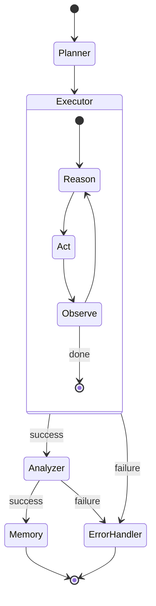

# MAP — Multi-Agent AI Automation Platform

[](https://github.com/yad4o/MAP/actions/workflows/ci.yml)
[](backend/tests)
[](LICENSE)
[](https://www.python.org/downloads/)
[](https://fastapi.tiangolo.com/)
[](https://react.dev/)
[](https://www.typescriptlang.org/)
[](https://peps.python.org/pep-0008/)
[](CONTRIBUTING.md)

> A production-grade distributed system that automates complex, multi-step intelligent workflows by decomposing them into discrete subtasks executed by specialized AI agents.

## Quick Start

### Prerequisites

- Docker Engine with Docker Compose
- Git
- API credentials for the AI provider(s) you plan to use

### 1. Clone and configure

```bash
git clone https://github.com/Yad4o/MAP.git
cd MAP
cp .env.example .env
```

Review `.env.example` before starting the stack. Keep `.env` local and never commit secrets.

### 2. Start the application

```bash
docker compose up --build
```

The default local services are exposed through the ports defined in `docker-compose.yml`. Check that file for the current port mappings rather than relying on hard-coded defaults.

### 3. Verify the backend

```bash
curl http://localhost:8000/health
```

A healthy instance returns JSON containing `"status": "ok"`. In development, the FastAPI docs are available at `/docs`.

### 4. Run backend tests

```bash
pytest backend/tests
```

For code-quality checks, use the repository's configured tooling from the backend environment (for example, Ruff and pytest as specified in `backend/requirements.txt`).

## Table of Contents

- [Quick Start](#quick-start)
- [Overview](#overview)
- [Architecture](#architecture)
- [Technology Stack](#technology-stack)
- [Modules](#modules)
- [Agent Pipeline](#agent-pipeline)
- [Database Design](#database-design)
- [Redis Architecture](#redis-architecture)
- [API Reference](#api-reference)
- [Docker Setup](#docker-setup)
- [BentoML Fallback](#bentoml-fallback)
- [Frontend](#frontend)
- [Security](#security)
- [Logging & Monitoring](#logging--monitoring)
- [Folder Structure](#folder-structure)
- [Development Plan](#development-plan)
- [Team](#team)
- [Environment Variables](#environment-variables)
- [Advanced Features](#advanced-features)
- [Contributing](#contributing)
- [License](#license)

---

## Overview

MAP accepts high-level task requests — natural language descriptions of complex workflows — and routes them through a structured multi-agent pipeline. Each agent has a defined role, tool set, and communication protocol. Results are persisted, observable, and retrievable.

### Problem It Solves

| Problem | MAP's Solution |
|---|---|
| Single LLM call handling all cognitive tasks | Specialized agents with separated responsibilities |
| No persistent context across steps | Memory Agent with FAISS/Chroma vector store |
| Hard dependency on one AI API provider | BentoML local fallback with circuit breaker |
| No task observability or traceability | Per-agent logging, step records, and trace visualization |
| Resource contention under concurrent load | Redis-backed Celery queue with worker pool |
| No access control | JWT auth with role-based access and API key scoping |

### Real-World Use Cases

- **Automated Research Pipelines** — decompose a topic into search, summarize, compare, and conclude steps
- **Code Review & Refactoring** — analyze repositories for anti-patterns, security issues, and improvements
- **Document Processing** — extract, cross-reference, and flag compliance issues in legal/regulatory documents
- **Data Pipeline Monitoring** — parse logs, detect anomalies, correlate errors, and generate root cause reports
- **Customer Support Automation** — classify intent, retrieve from knowledge base, draft and escalate responses
- **Multi-Modal Content Generation** — research audiences, generate copy variants, analyze compliance

---

## Architecture


```
  ┌──────────────────────────────────────────────────┐
  │                  CLIENT LAYER                    │
  │   React Dashboard (port 3000)  │  API Consumers  │
  └─────────────────────┬────────────────────────────┘
                        │ HTTPS
  ┌─────────────────────▼────────────────────────────┐
  │              NGINX REVERSE PROXY                 │
  │     TLS Termination │ Rate Limiting │ CORS        │
  └─────────────────────┬────────────────────────────┘
                        │
  ┌─────────────────────▼────────────────────────────┐
  │           FASTAPI GATEWAY  :8000                 │
  │    JWT Auth │ Validation │ Route Dispatch         │
  └──────┬────────────┬────────────┬─────────────────┘
         │            │            │
  ┌──────▼───┐  ┌─────▼────┐  ┌───▼─────┐
  │ Task Mgr │  │  Agent   │  │  Admin  │
  └──────┬───┘  │ Control  │  └─────────┘
         │      └─────┬────┘
  ┌──────▼────────────▼──────┐   ┌────────────────────┐
  │      REDIS  :6379        │   │   POSTGRESQL :5432  │
  │  Queue │ Cache │ Locks   │◄──►  Tasks │ Users │ Logs│
  └──────┬───────────────────┘   └────────────────────┘
         │
  ┌──────▼────────────────────────────────────────────┐
  │             CELERY WORKER POOL                    │
  │    Worker-1  │  Worker-2  │  Worker-3             │
  └──────┬────────────────────────────────────────────┘
         │
  ┌──────▼────────────────────────────────────────────┐
  │           AGENT CONTROLLER                        │
  │   Planner → Executor → Analyzer → Memory          │
  └──────┬────────────────────────────────────────────┘
         │
  ┌──────▼─────────────┐   ┌──────────────────────────┐
  │  PRIMARY INFERENCE  │   │   FALLBACK: BentoML :3001│
  │  Gemini / OpenAI   │   │   Mistral-7B (local)     │
  └─────────────────────┘   └──────────────────────────┘
```

### Request Lifecycle

1. Client submits task via `POST /api/v1/tasks` with JWT
2. Gateway validates token, checks rate limit, validates body
3. Task Manager writes record to PostgreSQL (`status=PENDING`), pushes `task_id` to Redis queue
4. API returns `202 Accepted` with `task_id` immediately
5. Celery worker picks up task, acquires Redis distributed lock
6. Agent Controller orchestrates: `Planner → Executor → Analyzer → Memory`
7. Each agent calls LLM via Fallback Engine (primary or BentoML)
8. Results written to PostgreSQL; status updated to `COMPLETED`
9. Redis pub/sub notifies frontend; client receives result via poll or WebSocket

---

## Technology Stack

| Technology | Version | Role |
|---|---|---|
| **FastAPI** | 0.115+ | Async Python API gateway and HTTP layer |
| **PostgreSQL** | 16+ | Primary relational database |
| **Redis** | 7.2+ | Queue broker, cache, distributed locks |
| **Docker / Compose** | 25+ / 2.24+ | Containerization and service orchestration |
| **BentoML** | 1.3+ | Local LLM serving for fallback inference |
| **Google Gemini** | 0.8+ | Primary AI provider (Gemini 1.5 Flash) |
| **OpenAI API** | 1.x | Secondary AI provider (optional) |
| **LangChain** | 0.3+ | Tool integration and chain management |
| **LangGraph** | 0.2+ | Stateful agent graph with checkpointing |
| **React** | 18+ | Frontend single-page application |
| **SQLAlchemy** | 2.0+ | Async ORM with migration support |
| **Alembic** | 1.13+ | Database schema versioning |
| **Celery** | 5.4+ | Distributed async task queue |
| **FAISS** | 1.8+ | Vector store for agent memory retrieval |
| **PyJWT** | 2.8+ | RS256 JWT authentication |
| **Pydantic** | 2.x | Request/response validation and typing |
| **Nginx** | 1.26+ | Reverse proxy, TLS, static file serving |
| **Structlog** | 24+ | Structured JSON logging |
| **Prometheus + Grafana** | Latest | Metrics collection and dashboards |

---

## Modules

### API Gateway
Single entry point for all requests. Handles JWT validation, Pydantic schema enforcement, rate limiting via Redis sliding window, CORS policy, error normalization, and request logging.

### Task Manager
Manages the full task lifecycle: creation, status tracking (`PENDING → PROCESSING → COMPLETED / FAILED`), cancellation, retry, and priority-based queue routing.

### Agent Controller
Orchestrates the multi-agent pipeline. Initializes agents with task-specific configuration, manages sequential and parallel dispatch, enforces per-step timeouts, and aggregates results into a `TaskResult`.

### Planner Agent
Decomposes a high-level task into a structured `PlanDocument`: a JSON array of `PlanStep` objects with tool assignments, dependency graph, and expected output schemas. Uses high-temperature LLM calls.

### Executor Agent
Carries out individual plan steps via a **ReAct loop** (Reason → Act → Observe). Available tools: `WebSearchTool`, `CodeInterpreterTool`, `FileReaderTool`, `APICallTool`, `MemoryRetrievalTool`.

### Analyzer Agent
Quality gate for Executor outputs. Validates JSON schema conformance, checks completeness and cross-step consistency, scores confidence (0.0–1.0), and triggers re-execution for steps below the confidence threshold (default: 0.7).

### Memory Agent
- **Short-term**: Redis-backed context for the active task (TTL: 1 hour)
- **Long-term**: FAISS/Chroma vector store per user. Embeds task summaries and retrieves relevant context before each Executor step

### Fallback Engine
Circuit breaker wrapping all LLM API calls. States: `CLOSED` (normal) → `OPEN` (using BentoML) → `HALF_OPEN` (testing recovery). Triggers on HTTP 429, 503, timeout, or malformed response.

### Queue Worker
Celery worker pool consuming from three queues: `default`, `high_priority`, `long_running`. Late acknowledgment mode prevents task loss on worker crash. Heartbeat monitoring via Flower.

### Auth System
RS256 JWT with 15-minute access tokens and 30-day refresh tokens. Token revocation via Redis SET. bcrypt password hashing (cost factor 12). Role-based access: `USER`, `ADMIN`, `SYSTEM`.

---

## Agent Pipeline

```
  Task Submitted
       │
       ▼
  ┌─────────────────────────────────────────────────────┐
  │ PLANNER AGENT                                       │
  │ Input: task description                             │
  │ Output: PlanDocument (steps, tools, dependencies)   │
  └───────────────────────┬─────────────────────────────┘
                          │
       ┌──────────────────┼──────────────────┐
       │                  │                  │
       ▼                  ▼                  ▼
  ┌─────────┐       ┌─────────┐       ┌─────────┐
  │ Step 1  │       │ Step 2  │       │ Step N  │
  │Executor │  ...  │Executor │  ...  │Executor │   (parallel where no deps)
  └────┬────┘       └────┬────┘       └────┬────┘
       │                 │                 │
       └─────────────────┼─────────────────┘
                         │
                         ▼
  ┌─────────────────────────────────────────────────────┐
  │ ANALYZER AGENT                                      │
  │ Validates all step results, scores confidence       │
  │ Requests re-execution if confidence < 0.7           │
  └───────────────────────┬─────────────────────────────┘
                          │
                          ▼
  ┌─────────────────────────────────────────────────────┐
  │ MEMORY AGENT                                        │
  │ Embeds task summary → FAISS/Chroma                  │
  │ Persists results → PostgreSQL                       │
  └─────────────────────────────────────────────────────┘
```
### LangGraph state graph



### Agent Message Format

```json
{
  "message_id": "uuid",
  "task_id": "uuid",
  "sender": "planner | executor | analyzer | memory",
  "recipient": "controller | agent_name",
  "message_type": "plan | step_result | validation | memory_context | error",
  "payload": {},
  "timestamp": "2025-01-15T14:30:22Z",
  "metadata": {
    "model_used": "gemini-1.5-flash",
    "tokens_in": 1847,
    "tokens_out": 312,
    "latency_ms": 2341
  }
}
```

---

## Database Design

All tables use UUID primary keys, `TIMESTAMPTZ` timestamps, and soft deletes. Core tables:

| Table | Purpose |
|---|---|
| `users` | Accounts with role, tier, bcrypt password hash |
| `sessions` | Refresh token hashes, JTI tracking, IP/UA logging |
| `tasks` | Full task lifecycle: status, config, result, error, retries |
| `task_steps` | Per-agent step records with token counts and confidence scores |
| `agent_results` | Structured outputs from each agent, with optional vector IDs |
| `logs` | High-volume structured log entries (BIGSERIAL PK) |
| `api_keys` | Hashed API keys with scopes and expiry |
| `configs` | Dynamic configuration store with optional AES-256 encryption |

### Key Indexes

```sql
CREATE UNIQUE INDEX idx_users_email       ON users(email);
CREATE INDEX idx_tasks_user_status        ON tasks(user_id, status);
CREATE INDEX idx_tasks_created_at         ON tasks(created_at DESC);
CREATE INDEX idx_task_steps_task_id       ON task_steps(task_id);
CREATE INDEX idx_logs_created_at          ON logs(created_at DESC);
CREATE INDEX idx_logs_task_id             ON logs(task_id) WHERE task_id IS NOT NULL;
```

---

## Redis Architecture

| Key Pattern | TTL | Purpose |
|---|---|---|
| `session:{user_id}` | 30 days | Cached session payload |
| `task:{task_id}:status` | 24 hours | Fast status polling |
| `task:{task_id}:lock` | 1 hour | Distributed lock against duplicate processing |
| `task:{task_id}:context` | 1 hour | Active task short-term memory |
| `rate:{user_id}:{window}` | 1 minute | Sliding window rate limit counter |
| `circuit:{provider}` | 10 minutes | Circuit breaker state |
| `revoked:{jti}` | 15 minutes | Revoked JWT tracking |

**Queue routing:**
- `default` — standard tasks, 3 workers
- `high_priority` — pro/enterprise tier, 2 workers
- `long_running` — document analysis, large file tasks, 4-hour max, 2 workers

---

## API Reference

### Auth
| Method | Route | Description |
|---|---|---|
| `POST` | `/api/v1/auth/register` | Create new user account |
| `POST` | `/api/v1/auth/login` | Authenticate, receive JWT pair |
| `POST` | `/api/v1/auth/refresh` | Rotate refresh token |
| `POST` | `/api/v1/auth/logout` | Revoke current refresh token |

### Tasks

| Method | Route | Description |
|---|---|---|
| `POST` | `/api/v1/tasks` | Create a task |
| `GET` | `/api/v1/tasks/{task_id}` | Retrieve task state/results |
| `POST` | `/api/v1/tasks/{task_id}/cancel` | Cancel a queued/running task |
| `POST` | `/api/v1/tasks/{task_id}/retry` | Retry a failed task |

### System

| Method | Route | Description |
|---|---|---|
| `GET` | `/health` | Basic application health check |

For the complete generated API surface, run the backend in development mode and open `/docs`.

---

## Docker Setup

The repository's Docker Compose file defines the local service topology. Use:

```bash
docker compose up --build
```

To stop the stack:

```bash
docker compose down
```

When debugging a service, prefer its Compose logs:

```bash
docker compose logs -f <service>
```

---

## BentoML Fallback

MAP can route inference to a local BentoML service when the primary AI provider is unavailable. The fallback engine uses a circuit-breaker model with `CLOSED`, `OPEN`, and `HALF_OPEN` states.

---

## Frontend

The frontend lives under `frontend/` and is a React + TypeScript application. Use the frontend package scripts for local development, unit tests, and production builds.

---

## Security

- Never commit `.env`, provider credentials, private keys, or other secrets.
- JWT access tokens are short-lived; refresh tokens are separately managed and revocable.
- Production CORS is driven by `CORS_ALLOWED_ORIGINS`.
- See [SECURITY.md](SECURITY.md) for vulnerability reporting.

---

## Logging & Monitoring

The backend uses Python logging plus structured application logging. Celery/worker monitoring is supported through Flower when enabled in the deployment configuration.

---

## Folder Structure

```text
MAP/
├── backend/          # FastAPI backend, agents, services, DB, tests
├── frontend/         # React + TypeScript dashboard
├── data/             # Local/application data assets
├── docs/              # Project documentation
├── docker-compose.yml # Local service orchestration
├── render.yaml        # Render deployment configuration
├── Makefile           # Common project commands
└── .env.example       # Environment variable reference
```

---

## Development Plan

See the repository issues and pull requests for the current implementation roadmap and work in progress.

---

## Team

See the repository's GitHub contributors and project history for current ownership and contribution activity.

---

## Environment Variables

The complete environment variable surface is maintained in `.env.example` and validated centrally in `backend/app/config.py`.

---

## Advanced Features

MAP includes agent orchestration, persistent task state, vector-backed memory, fallback inference, async workers, authentication, API-key support, logging, and deployment configuration. Refer to the corresponding source modules and the sections above for implementation details.

---

## Contributing

Read [CONTRIBUTING.md](CONTRIBUTING.md) before opening a pull request.

## License

MAP is licensed under the MIT License. See [LICENSE](LICENSE).
